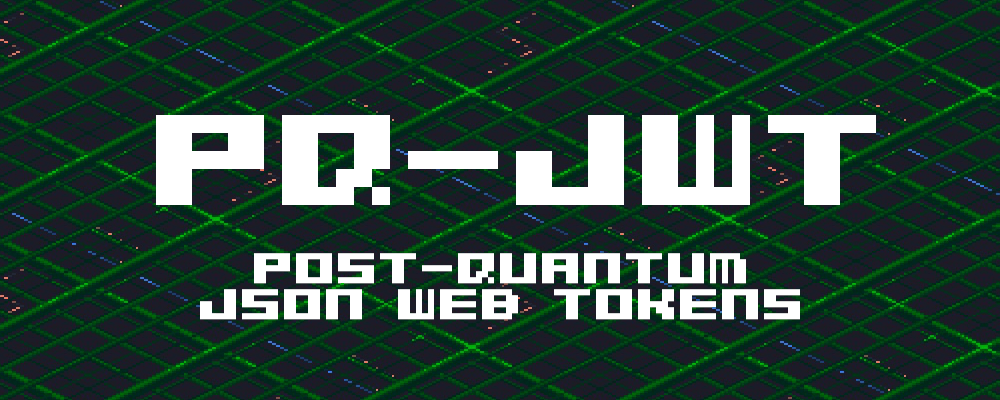

A JWT module for Deno that signs and verifies tokens using **ML-DSA** (FIPS 204) or a **hybrid ML-DSA + Ed25519** scheme for defence-in-depth during the post-quantum transition.


## Features

- **ML-DSA only** — `ML-DSA-44` / `ML-DSA-65` / `ML-DSA-87` via [`@oqs/liboqs-js`](https://www.npmjs.com/package/@oqs/liboqs-js)
- **Hybrid mode** — ML-DSA + Ed25519 signed in parallel. Both signatures must verify. If either algorithm is later broken (classical or quantum), the other still protects the token.
- Standard JWT claims: `exp`, `iat`, `iss`, `sub`
- Zero-dependency verification helpers, typed errors via `JwtError`


## Install

```sh
deno add jsr:@netopwibby/pq-jwt
```

Or import directly:

```ts
import { sign, verify } from "jsr:@netopwibby/pq-jwt";
```


## Usage

### ML-DSA only

```ts
import { generateKeyPair, sign, verify } from "jsr:@netopwibby/pq-jwt";

const { publicKey, secretKey } = await generateKeyPair("ML-DSA-65");

const token = await sign(
  {
    role: "member",
    sub: "user_123"
  },
  secretKey,
  {
    algorithm: "ML-DSA-65",
    expiresIn: 3600,
    issuer: "kern.neue"
  }
);

const claims = await verify(token, publicKey, {
  algorithm: "ML-DSA-65",
  issuer: "kern.neue"
});

console.log(claims.sub); // "user_123"
```

### Hybrid ML-DSA + Ed25519

```ts
import {
  generateHybridKeyPair,
  hybridSign,
  hybridVerify
} from "jsr:@netopwibby/pq-jwt";

const keys = await generateHybridKeyPair("ML-DSA-65");

const token = await hybridSign(
  {
    role: "admin",
    sub: "user_123"
  },
  keys,
  {
    expiresIn: 3600,
    issuer: "kern.neue"
  }
);

const claims = await hybridVerify(
  token,
  {
    ed25519PublicKey: keys.ed25519.publicKey,
    mlDsaPublicKey: keys.mlDsa.publicKey
  },
  {
    issuer: "kern.neue",
    variant: "ML-DSA-65"
  }
);
```

Both signatures must verify. If either fails, `hybridVerify` throws `JwtError`.

### Decode without verifying

```ts
import { decode } from "jsr:@netopwibby/pq-jwt";

const { header, payload } = decode(token);
```

Use only for inspection. Never use the result for authorization.

### Error handling

```ts
import { JwtError, verify } from "jsr:@netopwibby/pq-jwt";

try {
  await verify(token, publicKey);
} catch (err) {
  if (err instanceof JwtError) {
    console.error(err.code, err.message);
    // ERR_MALFORMED, ERR_TYPE, ERR_ALGORITHM,
    // ERR_SIGNATURE, ERR_SIGNATURE_MLDSA, ERR_SIGNATURE_ED25519,
    // ERR_EXPIRED, ERR_ISSUER, ERR_SUBJECT
  }
}
```


## API

| Export                                      | Description                                      |
| ------------------------------------------- | ------------------------------------------------ |
| `generateKeyPair(variant?)`                 | Generate an ML-DSA keypair (default `ML-DSA-65`) |
| `generateHybridKeyPair(variant?)`           | Generate a hybrid ML-DSA + Ed25519 keypair       |
| `sign(payload, secretKey, options?)`        | Sign a payload with ML-DSA                       |
| `verify(token, publicKey, options?)`        | Verify an ML-DSA JWT                             |
| `hybridSign(payload, keyPair, options?)`    | Sign with both ML-DSA and Ed25519                |
| `hybridVerify(token, publicKeys, options?)` | Verify a hybrid JWT (both must pass)             |
| `decode(token)`                             | Decode header + payload without verifying        |
| `KEY_SIZES`                                 | Raw byte sizes of keys per variant               |
| `JwtError`                                  | Error thrown on any verification failure         |


## Key sizes (raw bytes)

| Variant   | ML-DSA public | ML-DSA secret | Ed25519 public | Ed25519 secret |
| --------- | ------------- | ------------- | -------------- | -------------- |
| ML-DSA-44 | 1312          | 2560          | 32             | 32             |
| ML-DSA-65 | 1952          | 4032          | 32             | 32             |
| ML-DSA-87 | 2592          | 4896          | 32             | 32             |

ML-DSA signature lengths: `44 → 2420`, `65 → 3293`, `87 → 4595` bytes.


## Hybrid signature layout

```
[0..3]                 uint32 big-endian ML-DSA signature length
[4..4+mlDsaSigLen-1]   ML-DSA signature bytes
[4+mlDsaSigLen..]      Ed25519 signature bytes (always 64)
```

The entire blob is Base64url-encoded as the JWT signature segment.


## Run the example

```sh
deno run example.ts
```


## Security notes

`@oqs/liboqs-js` is research/prototyping software and has not been formally audited. The hybrid mode provides defence-in-depth during the PQC transition. Follow [NIST PQC guidance](https://csrc.nist.gov/projects/post-quantum-cryptography) for production deployments.


## License

MIT
